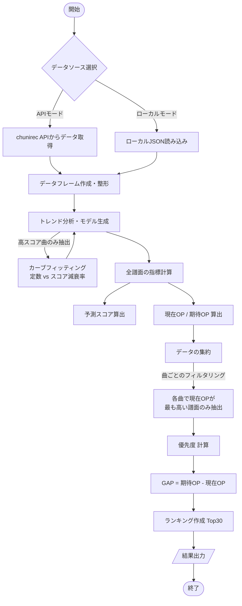

# CHUNITHM Score Potential Analyzer

CHUNITHMのプレイデータを統計的に分析し、現在の実力値に基づいて「スコアの伸びしろ（ポテンシャル）」が大きい楽曲を抽出するPythonスクリプトです。

単純にスコアが低い楽曲を羅列するのではなく、譜面定数ごとのスコア傾向を回帰分析することで、**「統計的に本来取れるはずのスコア」**を予測し、実力に対して過小評価されている楽曲を可視化します。

## 特徴

* **統計的スコア予測**: `scipy.optimize.curve_fit` を使用し、譜面定数に対するスコアの減衰トレンド（失点増加傾向）をモデル化します。これにより、個人の実力に基づいた現実的な目標ラインを自動生成します。
* **OverPower (OP) ギャップ診断**: CHUNITHMの仕様に基づき、楽曲ごとの最大OPを計算します。「予測される期待OP」と「現在のOP」の差分（GAP）を算出し、効率的にOPを伸ばせる楽曲を特定します。
* **データ取得の柔軟性**: `chunirec` APIからのデータ取得、またはローカルのJSONファイル利用の両方に対応しています。


## 動作要件

* Python 3.8+
* 以下のライブラリが必要です:
    * `pandas`
    * `numpy`
    * `scipy`
    * `requests`

## インストール

1.  このリポジトリをクローンまたはダウンロードします。
2.  必要なライブラリをインストールします。

```bash
pip install pandas numpy scipy requests
```

## 使い方

### 1. 設定の変更

スクリプトファイル（`make_list.py`）冒頭の設定エリアを編集してください。

```python
# ---------------------------------------------------------
# 【設定エリア】
# ---------------------------------------------------------
# データ取得モード設定
# True  : ローカルの 'data.json' を使用
# False : APIから新しく取得
USE_LOCAL_DATA = True 

# API設定 (USE_LOCAL_DATA = False の場合のみ必要)
API_URL = "[https://api.chunirec.net/2.0/records/showall.json](https://api.chunirec.net/2.0/records/showall.json)"
API_USER_ID = "YOUR_USER_ID"  # ユーザーID
API_TOKEN = "YOUR_TOKEN"      # トークン

```

### 2. データの準備

#### APIを使用する場合

* `USE_LOCAL_DATA = False` に設定し、`API_USER_ID` と `API_TOKEN` を入力してください。

#### ローカルファイルを使用する場合

* `USE_LOCAL_DATA = True` に設定します。
* chunirec等のデータ形式（JSON）を `data.json` という名前でスクリプトと同じディレクトリに配置してください。

### 3. 実行

```bash
python main.py

```

### 4. 出力結果の見方

コンソールに推奨楽曲のランキング（TOP 30）が出力されます。

| 項目 | 説明 |
| --- | --- |
| **Const** | 譜面定数 |
| **Score** | 現在のハイスコア |
| **Expect** | 統計モデルから算出された予測スコア |
| **Cur.OP** | 現在のOverPower |
| **Exp.OP** | 予測スコアに基づいた期待OverPower |
| **GAP** | **伸びしろ** (`Exp.OP` - `Cur.OP`)。この値が大きいほど狙い目です。 |

## 免責事項

* 本ツールは非公式ツールです。公式および関連企業とは一切関係ありません。
* APIトークン等の管理は利用者の責任で行ってください。

---

## 処理フローチャート

このツールの内部ロジックは以下の通りです。



```
